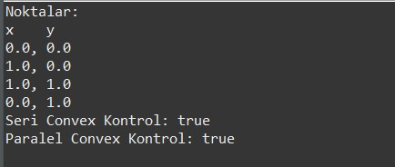
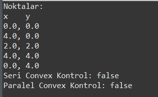

# Parallel-Convexity-Detection

Bu proje, verilen bir nokta dizisinin oluşturduğu çokgenin dışbükey (convex) olup olmadığını hem **seri** hem de **paralel (çok iş parçacıklı)** algoritmalar ile kontrol etmek amacıyla geliştirilmiştir.

Java programlama dili kullanılarak hazırlanmış bu uygulama, özellikle **paralel programlama** yapıları (threading, lock mekanizmaları) konusunda örnek teşkil etmektedir.

---

## Özellikler

- Koordinatları `.txt` dosyasından okuma
- Cross-product yöntemi ile dönüş yönü analizi
- Seri algoritma ile convexlik kontrolü
- Thread kullanarak paralel convexlik kontrolü
- Thread-safe veri paylaşımı (ReentrantLock ile)

---

## Teknik Detaylar

- Convexlik, üçlü nokta dönüş yönlerinin aynı olup olmadığına bakılarak belirlenir.
- cross_product_z(p1, p2, p3) fonksiyonu ile yön belirlenir.
- Paralel çözümde her üçlü set için bir Thread oluşturulur.
- Tüm dönüş yönleri ortak bir listeye yazılır.
- Ana thread, tüm sonuçları toplayarak çokgenin convex olup olmadığını belirler.

---

## Dosya Yapısı

```text
  ConvexPolygonChecker/
  ├── koordinatlar.txt # Girdi verisi (x,y şeklinde koordinatlar)
  ├── src/
  │ └── uygulama/
  │ └── ConvexKontrol.java # Tüm algoritmanın Java kodu
  └── README.md
```

---

## `koordinatlar.txt` Örnek Girdiler ve Program Çıktıları

| Output Sample 1                          | Output Sample 2                          |
|------------------------------------------|------------------------------------------|
|          |          |

---

## Kurulum ve Çalıştırma

### Gerekli:
- Java 17+ yüklü olmalı
- Eclipse, IntelliJ IDEA veya terminal kullanılabilir

### Terminal üzerinden:
```bash
javac ConvexKontrol.java
java ConvexKontrol
```

### Eclipse üzerinden:
  1. Eclipse'te proje dosyasını içe aktar (`File > Import > Projects from Folder or Archive`)
  2. Proje klasörünü seç ve finish butonuna tıkla 
  3. `ConvexKontrol.java` dosyasına **sağ tıkla**  → `Run As > Java Application`
  4. Konsolda program çıktısı görünmelidir


>Bu proje Bursa Teknik Üniversitesi 2024-2025 Bahar Dönemi Paralel Programlama Dersi için gönderilmiştir.
